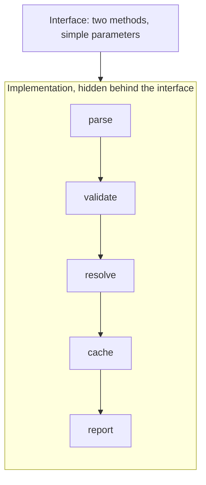
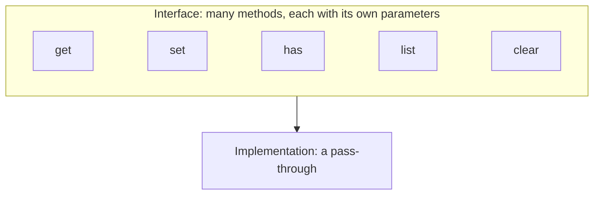

# Deep Modules

From "A Philosophy of Software Design":

**Deep module** = small interface + lots of implementation

**Shallow module** = large interface + little implementation (avoid)

When designing interfaces, ask:

- Can I reduce the number of methods?
- Can I simplify the parameters?
- Can I hide more complexity inside?
